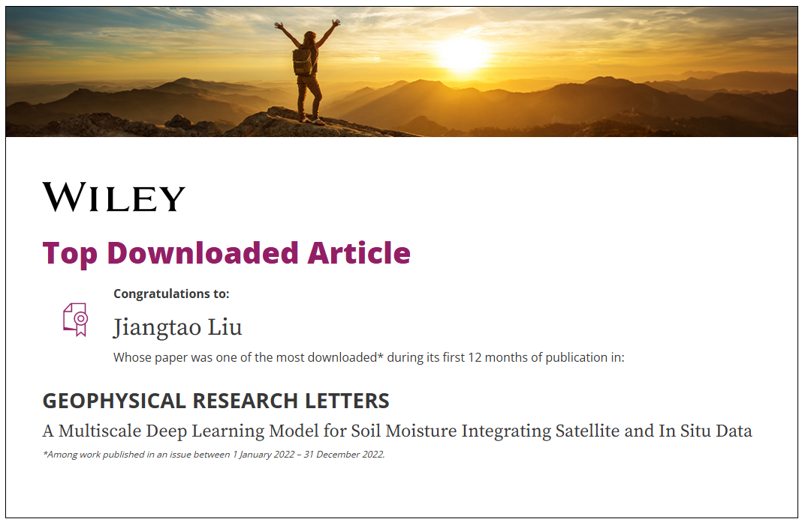

I am interested in utilizing multiple satellite datasets (e.g., SMAP, MODIS), in-situ observations, and reanalysis products (e.g., ERA5) to investigate how climate variability and human activities affect water resources. My research focuses on developing BERT/GPT-based foundation models that can be fine-tuned for tasks such as streamflow forecasting, soil moisture prediction, and water quality assessment. Additionally, I apply hybrid models that integrate physics-based hydrological approaches with deep learning techniques, ensuring predictions remain both accurate and physically interpretable. Ultimately, my goal is to provide robust, scalable, and transparent modeling frameworks to support decision-making from local watersheds to global scales. My expertise also includes zero-shot forecasting, cross-task transfer learning, and satellite imagery analysis (e.g., detection and segmentation).

## Selected Publications
- **Liu, J.;** Bian, Y.; Lawson, K.; Shen, C. Probing the Limit of Hydrologic Predictability with the Transformer Network. J. Hydrol. 2024, 637, 131389. [paper](https://doi.org/10.1016/j.jhydrol.2024.131389)
- **Liu, J.;** Rahmani, F.; Lawson, K.; Shen, C. A Multiscale Deep Learning Model for Soil Moisture Integrating Satellite and in Situ Data. Geophys. Res. Lett. 2022, 49 (7), e2021GL096847. [paper](https://doi.org/10.1029/2021GL096847)

## 🏆 News
- [April 2025] My first-author and corresponding-author manuscript, titled 'From RNNs to Transformers: benchmarking deep learning architectures for hydrologic prediction', is now available as a preprint at [HESS](https://doi.org/10.5194/egusphere-2025-1706)
- 🥇 [Top Downloaded: Jiangtao Liu’s GRL paper (2022)](https://doi.org/10.1029/2021GL096847)

