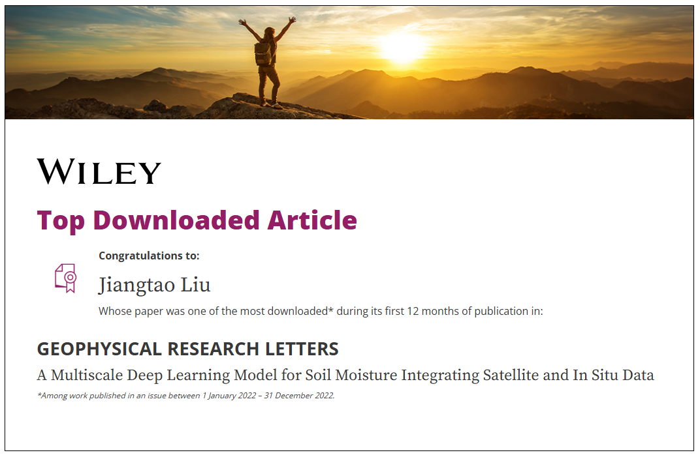

My research develops deep learning-based, data-driven and physics-informed modeling frameworks that integrate multimodal Earth observations to predict eco-hydrological extremes (e.g., floods, droughts, wildfires, and landslides) and their cascading effects on energy and infrastructure systems under changing environmental conditions and human influences. These models provide accurate, interpretable, and scalable risk information to support informed decision-making and enhance resilience across scales from local to global.

## Selected Publications
- **Liu, J.;** Shen, C.; O'Donncha, F.; Song, Y.; Zhi, W.; Beck, H.; Bindas, T.; Kraabel, N.; Lawson, K. From RNNs to Transformers: Benchmarking Deep Learning Architectures for Hydrologic Prediction. Hydrology and Earth System Sciences, 2025, 29, 6811–6832. [paper](https://hess.copernicus.org/articles/29/6811/2025/)
- **Liu, J.;** Rahmani, F.; Lawson, K.; Shen, C. A Multiscale Deep Learning Model for Soil Moisture Integrating Satellite and in Situ Data. Geophys. Res. Lett. 2022, 49 (7), e2021GL096847. [paper](https://doi.org/10.1029/2021GL096847)

## 🏆 News
- [Dec 2025] First-author & corresponding-author paper “[From RNNs to Transformers: benchmarking deep learning architectures for hydrologic prediction](https://hess.copernicus.org/articles/29/6811/2025/)” published in Hydrology and Earth System Sciences (HESS), selected as an Editor’s Highlight article.
- [Oct 2025] Co-authored paper “[Distinct hydrologic response patterns and trends worldwide revealed by physics-embedded learning](https://doi.org/10.1038/s41467-025-64367-1)” published in *Nature Communications*.
- [Oct 2025] Invited Guest Editor, Infrastructures (MDPI) – Special Issue: Advances in Geohazards for Infrastructures: Present and Future.
- [Aug 2025] Successfully defended my Ph.D. dissertation and completed my doctoral degree at The Pennsylvania State University.
- [Aug 2025] Serving as Primary Convener for the session "[Frontier AI Models Transforming Water Science (H069)](https://www.agu.org/annual-meeting)" at the American Geophysical Union (AGU) Fall Meeting 2025.
- [May 2025] Invited to serve as a Student Cluster Competition Reviewer ([SCC & IndySCC](https://sc25.supercomputing.org)) for SC25 – The International Conference for High Performance Computing, Networking, Storage, and Analysis.
- [May 2025] Joined the [ESS Open Archive](https://essopenarchive.org/inst/20904?current_inst_tab=members) editorial team as a moderator.
- [April 2025] My first-author and corresponding-author manuscript, titled "[From RNNs to Transformers: benchmarking deep learning architectures for hydrologic prediction](https://doi.org/10.5194/egusphere-2025-1706)", is now available as a preprint at *Hydrology and Earth System Sciences* (HESS)
- [Nov 2024] Co-authored paper “[Increasing phosphorus loss despite widespread concentration decline in US rivers](https://doi.org/10.1073/pnas.2402028121)” published in *Proceedings of the National Academy of Sciences* (PNAS).
- [Sep 2023] Co-authored paper “[Widespread deoxygenation in warming rivers](https://doi.org/10.1038/s41558-023-01793-3)” published in *Nature Climate Change*.
- [Oct 2021] Co-authored paper “[From calibration to parameter learning: Harnessing the scaling effects of big data in geoscientific modeling](https://doi.org/10.1038/s41467-021-26107-z)” published in *Nature Communications*.
- 🥇 Top Downloaded: Jiangtao Liu’s [GRL paper](https://doi.org/10.1029/2021GL096847) (2022)

