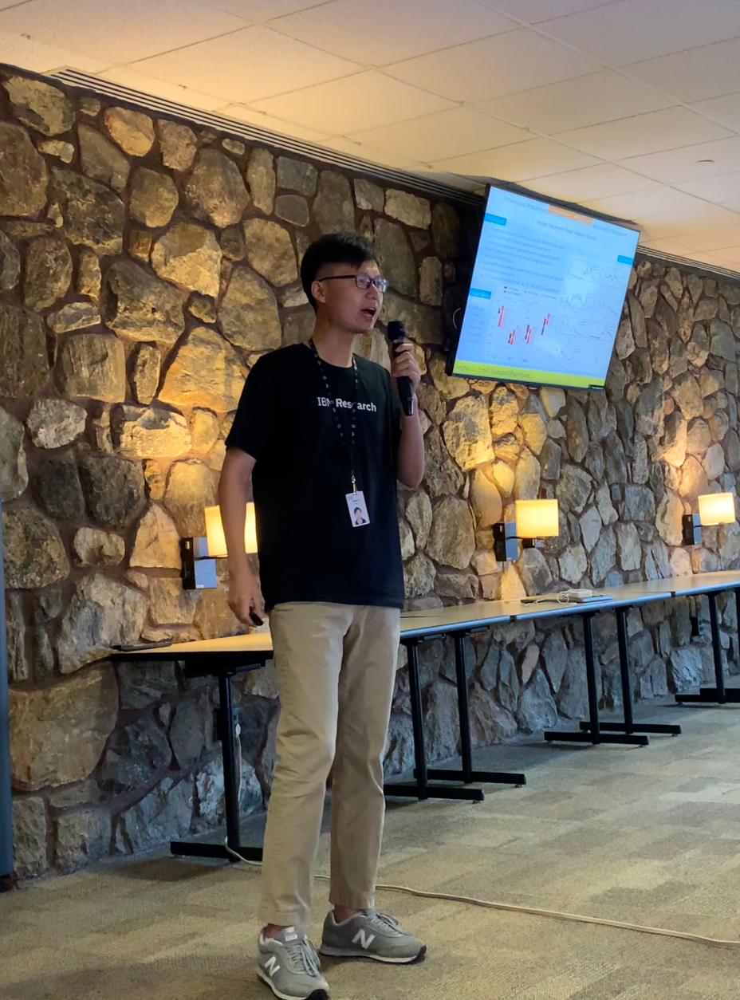
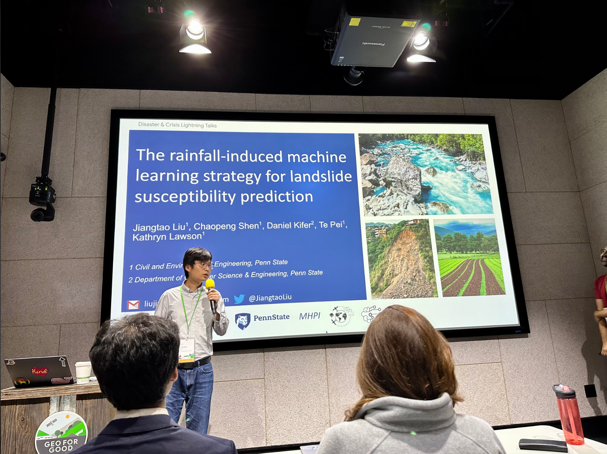

## Presentations

### 2025
- From RNN to Transformer: a comprehensive evaluation of time-series deep learning models. PIERS 2025 (April 2025)

### 2024
- Foundation Model for Understanding Landscape Hydrologic Coevolution. AGU Fall Meeting (Dec 2024)
- A General Framework for Hydrological Modeling: From RNN to Transformer. AGU Fall Meeting (Dec 2024)
- Can Attention Models Surpass LSTM in Hydrology? EGU Conference (April 2024)

  

### 2023
- Exploring Transformer Architecture in Predictive Hydrologic Modeling. AGU Fall Meeting (Dec 2023)
- Enhancing Soil Moisture Forecasting Using the PatchTST Model for Agricultural Risk Management. IBM Research (Aug 2023)
- A Multiscale Deep Learning Model Integrating Satellite‑Based and In‑Situ Data for High‑Resolution Soil Moisture Predictions. EGU Conference (April 2023)

  
  

### 2022
- The Machine Learning Strategy for Rainfall‑Induced Landslide Susceptibility Prediction. Google Geo for Good Summit (Oct 2022)
- A Global Soil Moisture Dataset Based on a Multi‑Scale Deep Learning Framework. HydroML Symposium (May 2022)

  
  

### 2020
- Automated Deep‑Learning‑Based Soil Moisture Planning and Forecast System for Planning Against Natural Disasters. AGU Fall Meeting (Dec 2020)

## Poster
