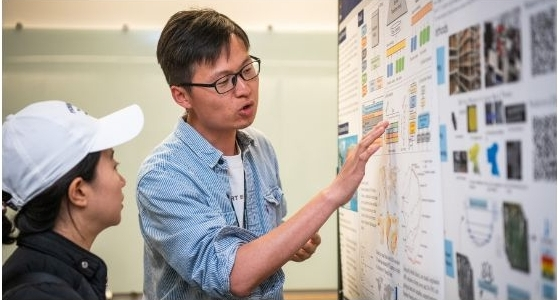
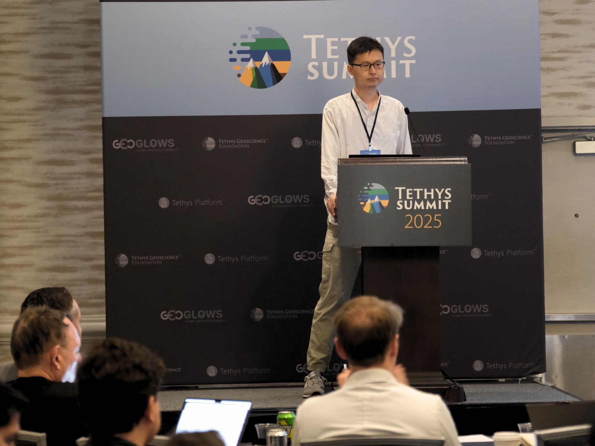
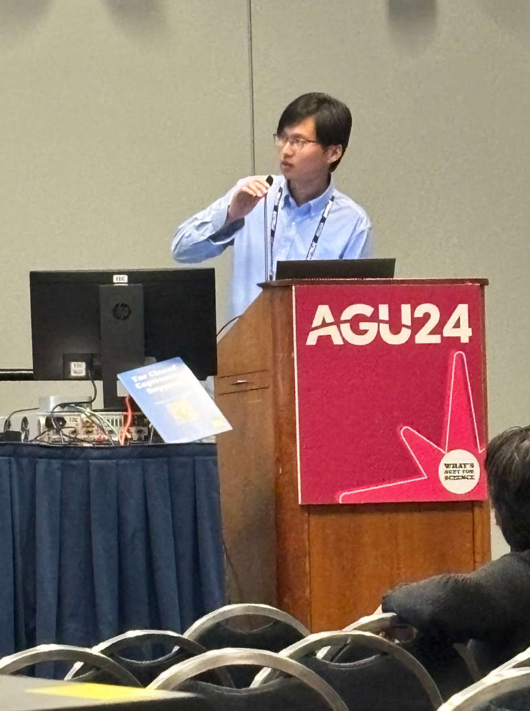
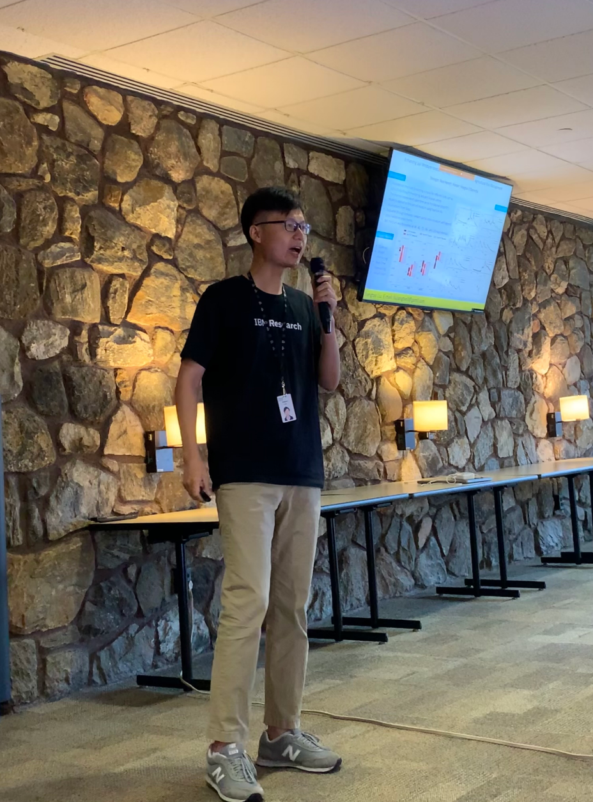
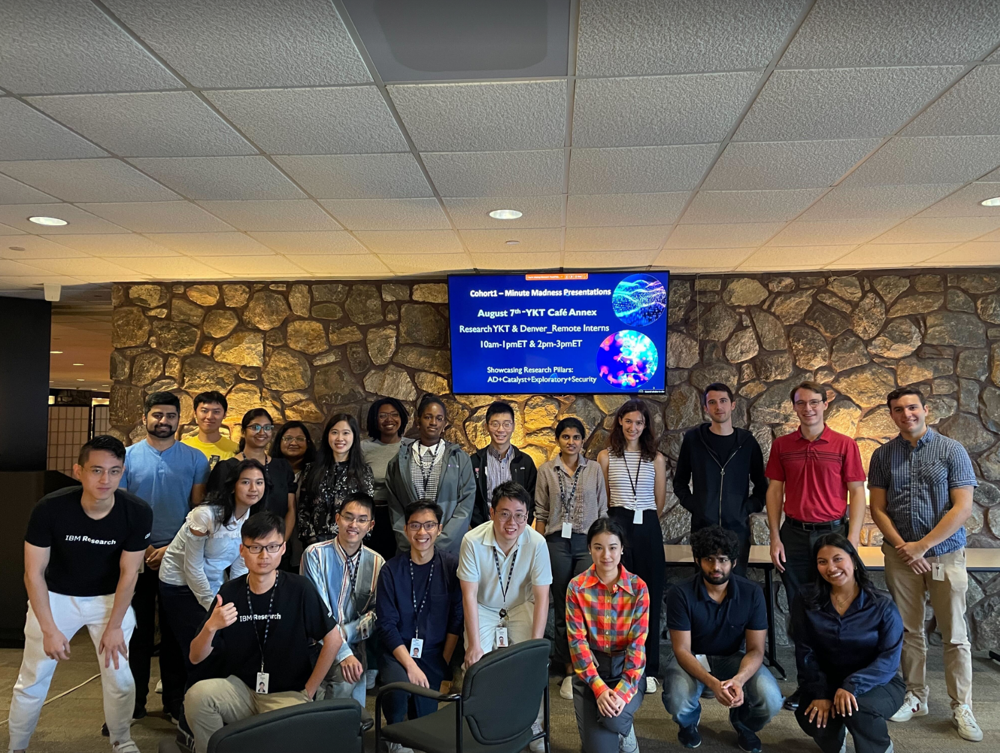
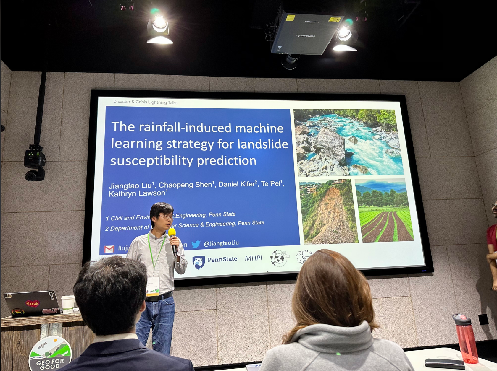
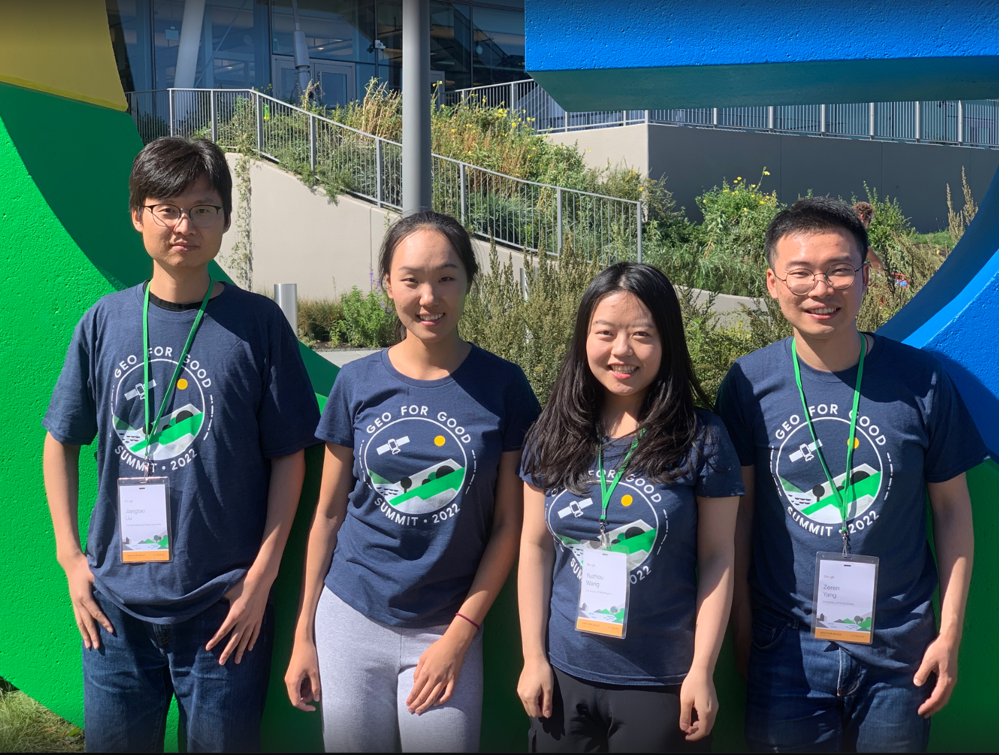

## 2026

- **Hands-on LSTM and Transformer for Operational Streamflow Prediction.** CIROH Developers Conference, University of Utah (May 2026, Workshop)
- **Deep Learning and Foundation Models for Hydrology.** Franklin & Marshall College (April 2026, Guest Lecture)

### 2025
- Building LSTM and Transformer Models for Hydrologic Prediction. DL4Water Online Workshop (October 2025, Tutorial)
- A Generative AI Approach to Assess Ecosystem Risks and Restoration Potential. Accelerating Computing for Emerging Sciences (ACES) Workshop (July 2025)
- Advancing Hydrological Predictions at National Scales with Deep Learning. Tethys Summit (July 2025)
- A Foundation Model for Understanding Landscape-Ecosystem Coevolution. Lawrence Berkeley National Laboratory (June 2025, Poster)
- From RNN to Transformer: a comprehensive evaluation of time-series deep learning models. PIERS 2025 (April 2025)

  
  

### 2024
- Foundation Model for Understanding Landscape Hydrologic Coevolution. AGU Fall Meeting (Dec 2024)
- A General Framework for Hydrological Modeling: From RNN to Transformer. AGU Fall Meeting (Dec 2024)
- Can Attention Models Surpass LSTM in Hydrology? EGU Conference (April 2024)

  

### 2023
- Exploring Transformer Architecture in Predictive Hydrologic Modeling. AGU Fall Meeting (Dec 2023)
- Enhancing Soil Moisture Forecasting Using the PatchTST Model for Agricultural Risk Management. IBM Research (Aug 2023)
- A Multiscale Deep Learning Model Integrating Satellite‑Based and In‑Situ Data for High‑Resolution Soil Moisture Predictions. EGU Conference (April 2023)

  
  

### 2022
- The Machine Learning Strategy for Rainfall‑Induced Landslide Susceptibility Prediction. Google Geo for Good Summit (Oct 2022)
- A Global Soil Moisture Dataset Based on a Multi‑Scale Deep Learning Framework. HydroML Symposium (May 2022)

  
  

### 2020
- Automated Deep‑Learning‑Based Soil Moisture Planning and Forecast System for Planning Against Natural Disasters. AGU Fall Meeting (Dec 2020)

## Poster
